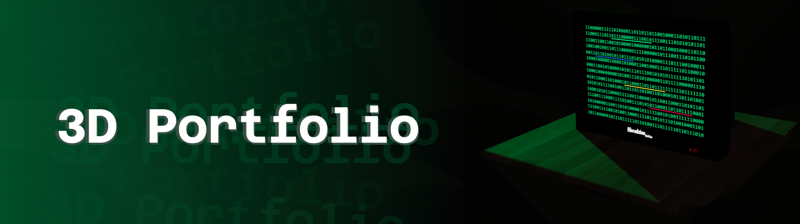

<div align="center">



# 3D Portfolio

**An interactive portfolio combining a GLB scene, React-powered screen content, and animated Three.js rendering.**

Explore Ebrahim's work through a retro television: binary navigation, rotating screen transitions, and lighting that follows each section.

<p>
  
  
  
  
</p>

[Getting Started](#getting-started) · [Architecture](#architecture) · [Technical Pipeline](#technical-pipeline) · [Report a Bug](https://github.com/ebhd/3dPortfolio-/issues/new)

</div>

## Explore the Screens

| Screen | Content | Lighting |
|---|---|---|
| **Home** | Binary grid with underlined navigation links; hover to reveal their labels | Green |
| **About Me** | A short introduction and programming interests | Blue |
| **Projects** | Project cards with descriptions, technology icons, and repository links | Yellow |
| **Contact** | LinkedIn, email, and GitHub links | Pink |

## Features

| | |
|---|---|
| **Interactive 3D scene** | A television and table loaded from a local GLB model, rendered with React Three Fiber. |
| **HTML inside the monitor** | React content sits on the television screen through Drei's transformed, occluded HTML overlay. |
| **Animated navigation** | The television rotates between sections, swapping its content halfway through the turn. |
| **Landing animation** | The monitor descends and rotates into place when the scene loads. |
| **Reactive lighting** | Section-specific colors, a flickering emissive screen, and soft shadows establish the retro atmosphere. |
| **Responsive camera** | Separate desktop and mobile camera settings preserve the scene's fixed composition. |
| **Project browsing** | Two project cards per page, with previous/next controls and external repository links. |

## How It Works

The page hosts a Three.js canvas. `Scene` owns the active screen, `Monitor` coordinates animated navigation, and the screen components render ordinary React content inside the 3D display.

```text
App page → Canvas → Scene
                    ├── FixedCamera       → desktop/mobile framing
                    ├── Monitor           → GLB model + screen transitions
                    │   ├── LandAnimation → entrance movement
                    │   └── Html          → Home / About / Projects / Contact
                    └── SceneLights       → active-screen color + shadows
```

Navigation stays within the scene: selecting a section changes React state rather than loading a separate page.

### Architecture

| Area | Responsibility |
|---|---|
| `app/` | Next.js layout, fonts, global styles, and the canvas entry point |
| `components/Scene.tsx` | Active-screen state, responsive camera, and scene composition |
| `components/Monitor.tsx` | Model loading, screen material, rotation transitions, and embedded HTML |
| `components/SceneLights.tsx` | Ambient and spot lighting, color transitions, and shadow settings |
| `components/LandAnimation.tsx` | Configurable entrance movement and rotation |
| `components/Screens/` | Navigation grid, biography, project cards, pagination, and contact links |
| `utils/blender.ts` | Conversion from Blender coordinates to Three.js coordinates |

## Tech Stack

| Purpose | Technology |
|---|---|
| Application framework | Next.js 15 with the App Router |
| UI and state | React 19.2 |
| Language | TypeScript 5 |
| 3D rendering | Three.js and React Three Fiber 9 |
| Scene utilities | Drei 10: GLB loading, camera, and HTML overlay |
| Styling | Tailwind CSS 4 and CSS Modules |
| Icons | Font Awesome |
| Model format | Binary glTF (`.glb`) |
| Code checks | TypeScript and ESLint 9 |

## Getting Started

### Prerequisites

- Node.js and npm; local development has been checked with Node.js 24.
- A browser with WebGL support and hardware acceleration enabled.
- Internet access for dependency installation and the Google Fonts used by `next/font` during compilation.

### Install and run

```bash
git clone https://github.com/ebhd/3dPortfolio-.git
cd 3dPortfolio-
npm ci
npm run dev
```

Open [http://localhost:3000](http://localhost:3000), or the address printed in the terminal if that port is already occupied.

The same commands work in PowerShell, macOS, and Linux terminals. No database, API keys, or environment variables are required by the current application.

### Production build

```bash
npm run build
npm start
```

### Code checks

```bash
npx tsc --noEmit
npm run lint
```

The ESLint command above runs directly with the repository's flat configuration.

## Using the Portfolio

1. Let the television finish its entrance animation.
2. Hover over the underlined binary text to reveal a section label, then click it.
3. Wait for the rotation to finish before choosing another section.
4. Use **Back** to return home, or **Prev** and **Next** to browse the project cards.

The camera stays fixed; navigation happens through the monitor's screen.

## Project Structure

```text
app/
├── layout.tsx                 # Root layout and fonts
├── page.tsx                   # Canvas entry point
└── globals.css                # Tailwind entry point
components/
├── Scene.tsx                  # Scene state and camera
├── Monitor.tsx                # Model, materials, and screen transitions
├── SceneLights.tsx            # Lighting and shadows
├── LandAnimation.tsx          # Entrance animation
└── Screens/                   # Portfolio content and binary-grid styles
public/
├── models/tvnolight.glb        # Television and table model
├── logos/                     # Technology icons
└── textures/                  # Texture assets
utils/
└── blender.ts                 # Coordinate conversion
docs/
└── images/readme-banner.png   # Documentation banner
```

## Technical Pipeline

### Model loading and coordinates

Drei's `useGLTF` preloads `/models/tvnolight.glb`. The monitor component uses the model's named nodes, including `Table`, `TV`, `Screen`, and the `Curve` parts. Replacing the asset requires preserving those names or updating the component's node references.

Positions authored in Blender pass through `blenderToThreeCoords`:

```text
Blender [x, y, z] → Three.js [x, z, -y]
```

### Screen transitions

A navigation request records the next section and starts a full television rotation. Once the rotation passes halfway, the active screen changes and the lighting begins blending toward the new section's color. At the end, the rotation resets and navigation becomes available again.

```text
Select section → rotate → swap content halfway → finish rotation → accept input
```

The landing, rotation, and lighting animations use per-frame interpolation, so their duration can vary with frame rate.

### Rendering quality

The canvas enables antialiasing and soft shadows, with a device-pixel ratio between 1 and 2. The spotlight uses a 2048 × 2048 shadow map. Model textures receive anisotropic filtering up to 8×, capped by the graphics device's capabilities.

The monitor screen combines an emissive material with a transformed HTML overlay. Its flicker comes from a time-based pulse, randomized jitter, and occasional brighter flashes.

## Customization

| Change | File |
|---|---|
| Biography | `components/Screens/AboutScreen.tsx` |
| Project titles, descriptions, links, and technologies | `components/Screens/Project.tsx` |
| Project-card layout and technology icon mapping | `components/Screens/ProjectCard.tsx` |
| Contact destinations | `components/Screens/ContactScreen.tsx` |
| Binary navigation and hover labels | `components/Screens/BinaryGrid.tsx` and its CSS Module |
| Camera positions and mobile breakpoint | `components/Scene.tsx` |
| Section lighting colors and intensity | `components/SceneLights.tsx` |
| Monitor materials and rotation | `components/Monitor.tsx` |

<details>
<summary><strong>Troubleshooting local setup</strong></summary>

- **Cannot resolve `@react-three/fiber`, `@react-three/drei`, or `three`:** stop the development server, run `npm ci` from the repository root, and restart `npm run dev`.
- **React dependency conflict:** keep React and React DOM aligned with the versions in `package.json`. The installed React Three Fiber version requires React below 19.3.
- **Google Fonts fetch error:** check internet access during compilation; the root layout loads Geist through `next/font/google`.
- **Blank 3D scene:** check browser WebGL support, hardware acceleration, and whether `public/models/tvnolight.glb` is present.
- **Port already in use:** use the alternate address printed by Next.js, or run `npm run dev -- --port 3001`.

</details>

## Contributing

Bug reports and focused improvements are welcome through [GitHub Issues](https://github.com/ebhd/3dPortfolio-/issues). For code changes:

1. Create a branch for one focused change.
2. Preserve camera framing, object placement, and navigation behavior unless the change explicitly targets them.
3. Run the code checks and `npm run build`.
4. Check the entrance animation, all four screens, project pagination, and mobile framing in a browser.
